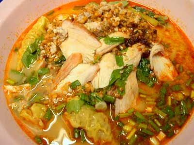

.. post:: 28 August, 2005
   :tags: Bangkok, Tom Yam, Baamee
   :author: w.tknv
   :language: jp
   :location: Asok

バーミートムヤムピセーセンミーソンターウ
========================================

| さて、二日酔いの日に。
| ここのバーミートムヤムは絶品、場所は地下鉄のスクムビット駅でソイカーボーイ側の出口から出てスカイトレイン側の交差点(アソークの交差点)にある黄色い看板の屋台です。
| ハイ、注文は「バーミートムヤムピセーセンミーソンターウ　ナ　クラップ」男用の注文で訳はたぶん、「タイトムヤムらーめんスペシャルで麵2倍　です」
| たいして辛くなく、チャーシュウ、ワンタン、野菜、ナッツ、ひき肉などが入って、最高！

| 45B(約140円ぐらい)
| 夕方6時ごろより開店。