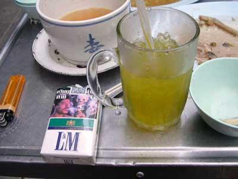

.. post:: 25 August, 2005
   :tags: Bangkok
   :author: w.tknv
   :language: en
   :location: Yaowarat

at Bangkok, advertising is too NEW 2
=====================================

What a GREAT and too New advertising this is.
Certainly L&M sales is gonig to up by such a kids consumer likes skull.There is some scheme.
None of kids think skull is worse, moreover kids like skull so cool even adult too.
When I'm buying,I choose skull pic on my favour tabaco.

::

   Add,Feb,1st,2012.  
   At that time, three cigarettes was 5B(thai bath).  
   Now 17B(thai bath).  

たばこ3本で商店街のおばちゃんに5バーツ渡したら、"はぁ？！？、死ね"って顔で見られたが、
5バーツじゃないの？って聞いたら、 **「17バーツだ、ゴラァ！」** と吠えてるので、「じゃっ、いらないっ」で帰りました。
もちろん隣のおばちゃんには、「なに、あのケチ」といっておりました。

江戸っ子のような気っ風のいい、宵越しの金は持たないタイ人からすると、チンケなケチなんでしょう。

今の安たばこは、SMSというのがあります。１箱、33B。

アパートやコンドミニアムの賃貸料は、ほとんど変わっていないのに、たばこ、定食屋の値段は結構高くなりました。

ソムタムは30-35バーツだし、ラープムーも40バーツからのように、20バーツで食べれらるものなんてもうない。
バーミーナームも30バーツから。

ガソリンはリッター3バーツぐらいの値上がりのような気がするのですが、人件費が上がったようですね。