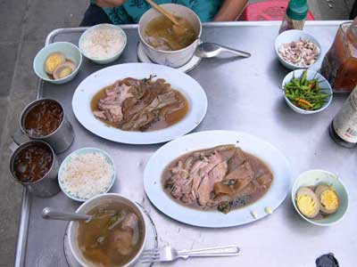
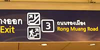
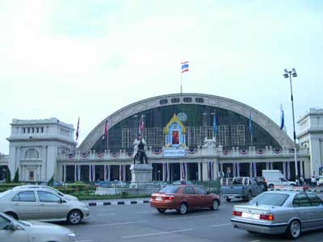
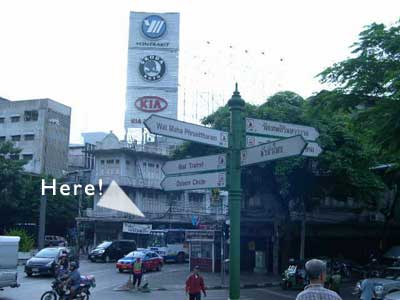
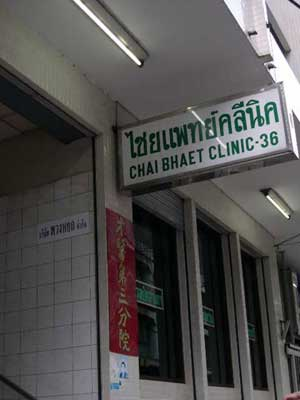

.. post:: 22 August, 2005
   :tags: Bangkok
   :author: w.tknv
   :language: jp
   :location: Yaowarat

ガテン系がっつり派ごはん
=================================

今回のごはんはカウカームウ・セット(煮豚ごはん)．まずは行き方ですが，
一番分かり易いのはバンコクの地下鉄でファランポーン駅(Hua lamphong)へ．

   ここの出口からが近いです．

タイ国鉄の駅が見えますそして，

てくてくと歩くとこんな5叉路がHere!(川から基準に右から2本目)を入りさらに進みます，
途中にMPなどありますが食後にどうぞ，てくてくと，そして

.. image:: destnear.jpg

が見えてきます．この建物はabout cafeと言ってここ最近にできたcafeでコーヒーも飲めてエアコンがあるのにもかかわらず，
たばこも吸えます．さらに催し物がなければ本もたくさんあります．バンコクではクーラーがあるところは禁煙が多いのです．
そしてまた，５叉路がHere!(この建物を基準に左から２本目)を入ります，とてもタイらしい通りです．すると CHEAT BHAET CLINIK-36が見えます．

のような病院が見えてきます．ここです．お疲れさまです．

その屋台は，カウカームウをメインとし日替わりのスープ，茶碗蒸し，花の飲み物(目に良い)など、全部注文してご飯を2,3杯食べても70Bぐらい。
ここで、始めての方へ、注文の仕方ですが、
ガッツリ派の場合はカウカームウ(煮豚ごはん)は別盛りにしましょう、でないとご飯に煮豚がかけられ、おかわりの体制がとりにくいです。

タイ語で「カウカームウ　イヤーク」とか言えば通じます。カタカナでは表現しきれなく僕のタイ語も変ですが。

それで日替わりスープは屋台の左に配備また櫃に入ってますのでお好みのを指差しで、
みかんベースに骨付き豚と松の実、大根や苦瓜、椎茸などの日は当たりです、写真の時はザーサイ豚のスープでした。

注文後席に着き、にんにくでも剥いて、きたる豚の脂に備えると。

また、中華街は基本的にお茶がただです、他のエリアではお金がかかりますが。
