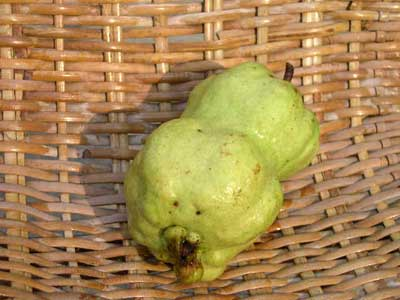
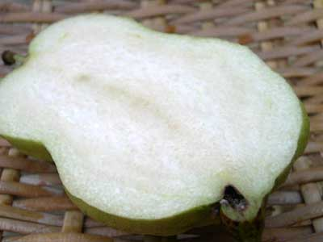
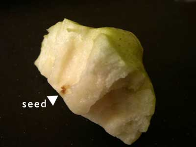

.. post:: 25 August, 2005
   :tags: Bangkok
   :author: w.tknv
   :language: jp
   :location: Ban Khae

シードレスグアァバ
============================

今回はバンケー(チャオプラヤー川を渡った先の方)のシードレスグァバ

おととい、友達の家で成っているグアバをもらいましたが、なんと種無しなのです。

一見ちょっとカタチの悪いグァバですが,,,

通常は食べていてもボリボリと種を一緒に食べる事になるのですが、おっ種がない！
とても、食べやすくおいしいく、グァバ好きにはたまらない.
まったく、ぜんぜん、ダジャレじゃないですが種明かししますと.

じつは、このシードレスグァバは「リンゴ」とのハーフなのです.
グァバのような食べにくい白い小さい種はなく、かすかに小さいリンゴの種のような茶色い部分が種で
種はりんごの色でサイズはグァバといったところでした.
