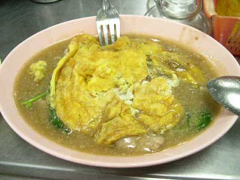
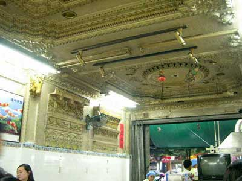

.. post:: 15 September, 2005
   :tags: Bangkok
   :author: w.tknv
   :language: jp
   :location: Petchkasem

なかなかうまいランナー3杯はいける
====================================

バンコク中心部に住んでるとちょっと遠いですが、何かの際には、

| 場所はパヤタイ病院3です、パヤタイ病院1はソープランドがあるJ-ONEやCHAOPLAYAの近くで、パヤタイ病院2はパヤタイ駅の近くですが、ここ、パヤタイ病院3はチャオプラヤー川を渡った、ペッカセーン通りです。バスでしたら80番や7番、エアコンの25Bバスの12番、で行けます。パヤタイ病院3を向かって右隣の3件目ぐらいです、盛り上がってますので、
| 簡単に分かります。

.. figure:: lannaa.jpg

   これはランナーガイ。

   これはランナーガイ・カイチアオ。
   卵焼き乗せですね。写真撮る前に手を付けてしまいました、、、

| 安いですが、内装は豪華です。
| なかなかうまいですよ。
| 1杯30Bぐらいだった(90円ぐらい)