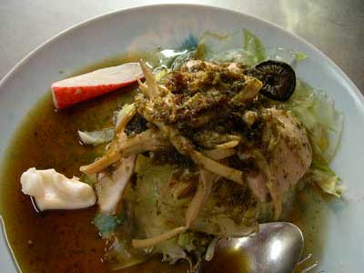

.. post:: 15 September, 2005
   :tags: Bangkok
   :author: w.tknv
   :language: jp
   :location: Charoen Krung

怒りのKING of SENHAIG NOODLES
================================

「ヘン！ナーム！」といきなり睨んだ顔で聞かれます、

| どうゆう事か分からないと思いますが、汁無しか汁有りか、聞いているのです。
| 僕も始めてのときはたじろぎ、「ヘン」と弱気な返答しましたが、ここの上海麵は、梅味のあっさりしたソースで上海麵の下にキャベツがあり食感のハーモニーが最高で、チャーシューも2,3種は入り、味付け椎茸に海老やイカ、しなちくも、おいしいです。
| 写真のは「ヘン」です、メニューもこれぐらいしかないです。
| 怒って帰ったお客も見た事あります。
| 場所はCHAROEN KRUNG 17近くにセブンイレブンがあり、その向かって左の隣の隣ぐらいで、この麵屋の左隣は、ゲイやホモの方々の出会いの場の映画館です。知らずにセブンでスナックとコーヒー買って見に行ったら、そうゆうところでした。
| 「たばこくれ」と言うときの男性の間合いが近すぎで、スクリーンの前では何かおっぱじまってます。
| クロントムセンターやマハチャック通りの近くです。
| 60B(180円ぐらい)
| 氷2B(6円ぐらい)
| お茶はフリー
| 食欲があまり無い時、タイ飯に飽きた、そんな時におすすめです。
| 5時ぐらいには閉まります。
