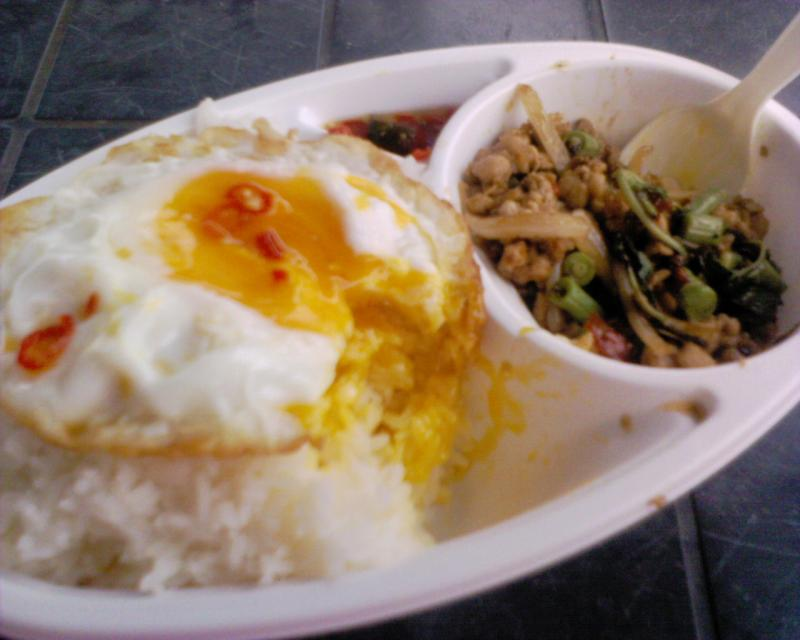
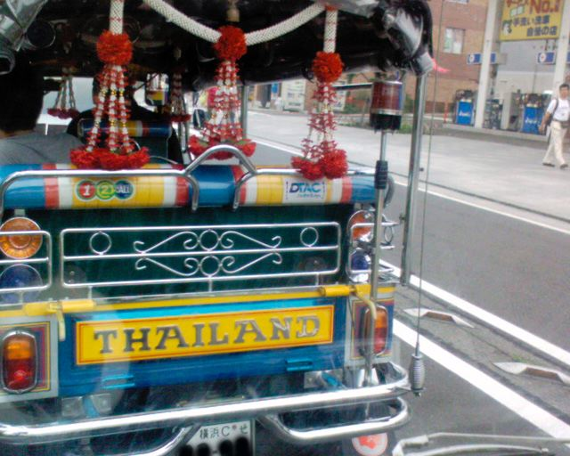

.. post:: 24 July, 2006
   :tags: Kamakura, Gapao Gai Kai Dao Mai Suk
   :author: w.tknv
   :language: jp
   :location: Yuigahama

日本ですがタイ料理
===============================

日本ですが、そこそこ手軽な値段で食べれるタイ料理です。タイの定食屋、屋台メニューが多いです。場所は由比ヶ浜海岸

では、注文は、ガッパオ　ガイ　カイダーオ　マイスック　です。全開定食屋の味です。店員もタイ人、タイ語も通じる、日本語も通じる.
ガッパオはタイバジル，ガイは鶏肉，カイダーオは目玉焼き，マイスックは半熟（完全に煮え切らないというような感じ）

白タクかな？