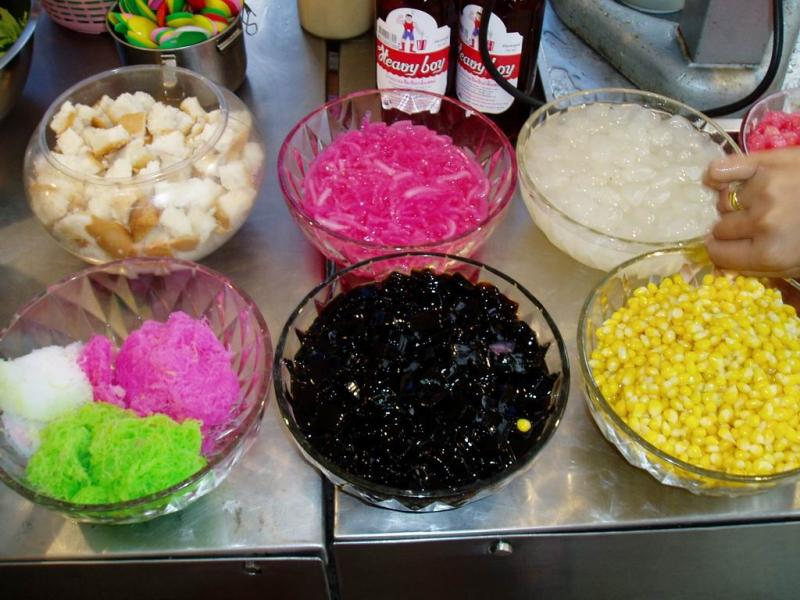
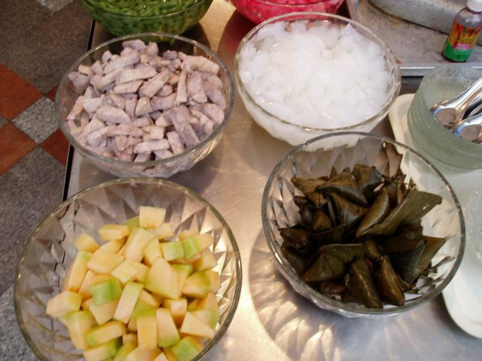
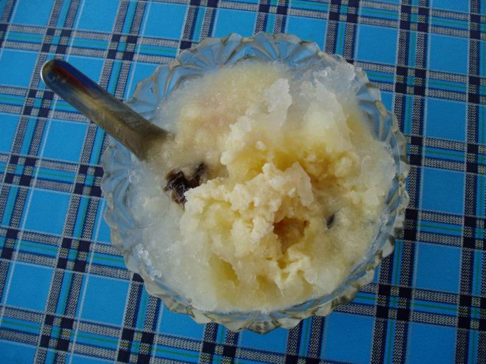

.. post:: 16 September, 2006
   :tags: Bangkok
   :author: w.tknv
   :language: jp
   :location: Saphan Phut 

お気軽デザート。-自分で選んで、ラーメン次郎のようにお好みで-
==================================================================

| 左上から、カノムパン(パン)、タプティンコン、ナタデココ．
| 左下から、ココナッツ寒天3色(見た目の通り、メロン味、いちご味)、チャオクワイ、コーン．
| 氷が怖い人と合成着色料が怖い人にはおすすめしませんがうまいです．

こんなオプションもあります。

| 結局、こんな感じに落ち着きます。
| 普通に練乳ミルクにメロンとかもうまい。
| 場所は、タイならどこでもあります。
| サパンプットなどには、オールドスクールで氷をかんなで削るところなんかもあります。
| そうゆうとこには、小豆もトッピングに配備されてる。
