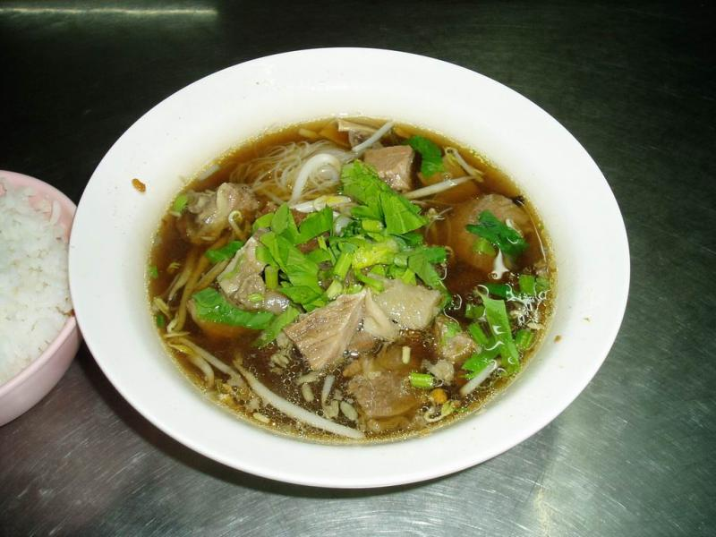
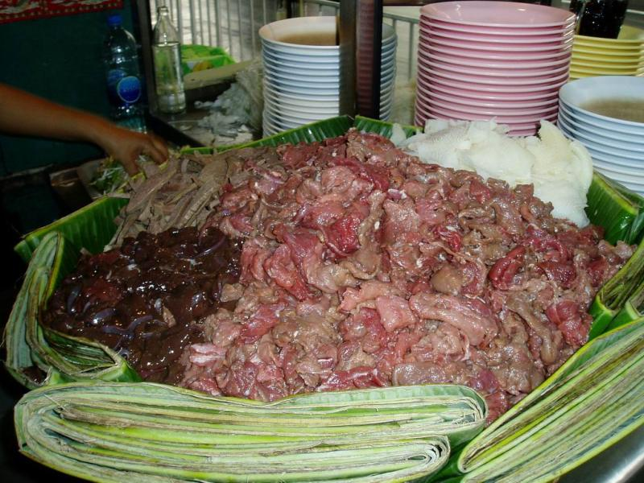
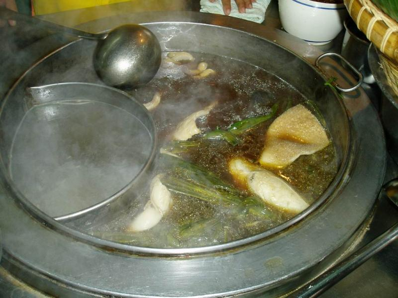

.. post:: 14 September, 2006
   :tags: Bangkok
   :author: w.tknv
   :language: jp
   :location: Makkasan

昼食にお困り時は
=============================

| 写真の麺はセンミー. 麺は他センレク、センヤイから選べます.
| 具に牛の生レバー、胃袋、赤身をさっと湯に通しレア状態のこれらが入りますが、お腹に自信のない人は、
| 入れない方が無難。
| それからルークチン（魚のすり身）入りますが生臭いのが難点なので入れない方が無難かも

   慣れたら、入れずにいられないです。

このスープがうまい。

| 味は中国の醤油ベースで少々甘いですが日本の牛丼近い味なのでご飯との相性が抜群
| 日本人なら誰しも気に入る麺です。
| 場所は伊勢丹から北、インドラリージェントホテルを超えて、100M程
| マッカサン踏み切りの30M手前　価格は、麺30B　ご飯5B　お茶2B
| 営業時間は、朝8時から夜8時まで.
| ここの店のいいところは閉店間際でも、スタッフが嫌な顔しないのが好感持てます。
| プロは、麺なしで、つまみに。
