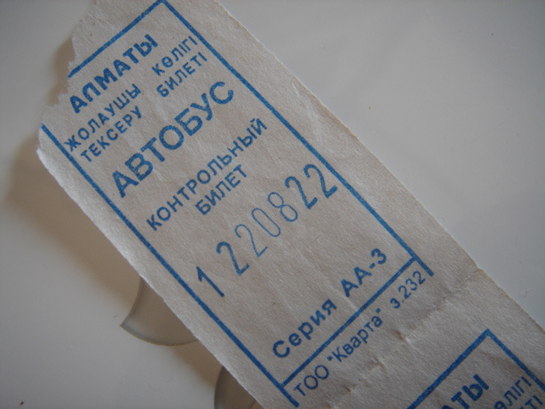
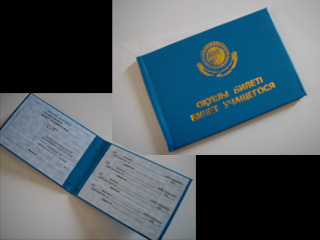
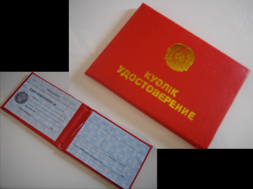

.. post:: 18 February, 2007
   :tags: ID, Bus
   :author: w.tknv
   :language: jp
   :location: Kazakhstan

カザフスタンでよくみるもの
====================================

| バスチケットです、もっぱら40テンゲ(約40円)。どこまでいっても同一料金。
| 29番はよくつかうバスだと思います。(ドスティック通りを行き来しています。)
| 最近、バスナンバーが変更中なので注意が必要、ロンリープラネットの情報も変わると思います。

こちらは、学生証、バスで提示すると割引されているっぽいです。

こちらは、仕事につかうID見たいです。

| バンコクでもそうでしたが、カザフスタンでもバスに乗ると貧乏人に思われるみたいです。
| 運転しなくて楽でいいんですけどね。
| あと、最終バスは早いです、19:30ぐらいをすぎたら気をつけましょう。
