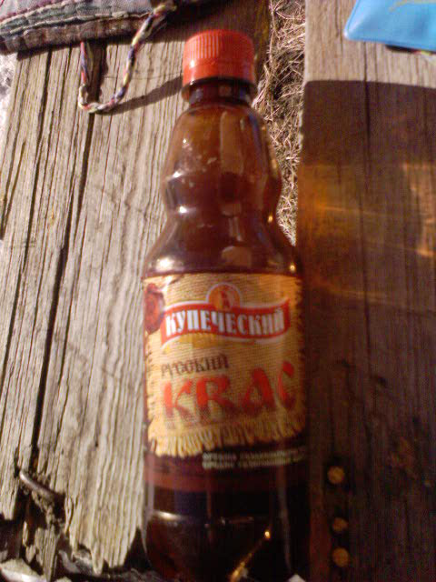

.. post:: 18 February, 2007
   :tags: Kvass, Malt
   :author: w.tknv
   :language: jp
   :location: Kazakhstan

炭酸麦芽系ドリンク、甘くないです。
====================================

これも、きっと、ペリエがずーーーーーーーーーーっと、日本であまり飲まれなかったのと同様に、時間がかかるでしょう。

でも、これは、まずいかな、次に紹介するほうがうまいです。

| 自家製だとうまいのはある．後日タイのパタヤ在住のロシア人がつくるクワースは美味しかった．
| また，アルコールが高めで良かった．
| 中近東のクワース（モルト系ドリンク）はオシャレなフレーバーで洗練されててそれもおいしい．
