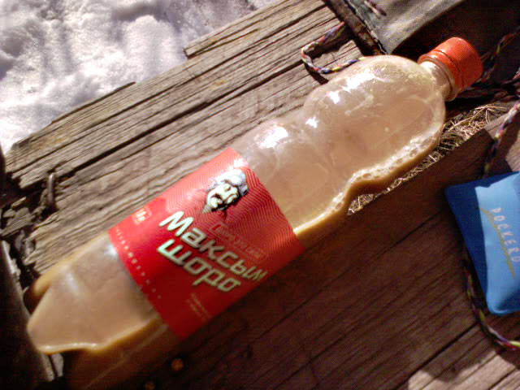

.. post:: 18 February, 2007
   :tags: Shoro, Шоро
   :author: w.tknv
   :language: jp
   :location: kyrgyzstan

こっちが、うまい！ショーロ
====================================

| こっちがうまい、キルギスタンのナショナルドリンク(たぶん)
| ショーロです。

| バケツなどでも、売ってるんです。
| アルマティーのスーパーだと、35テンゲ(35円ぐらい)ぐらいだったような
| あと、きれいなスーパーでも賞味期限は切れてるときがあります。
| グリーンバザールか、サイヤハットからバスで行くフードマーケットがお薦めです。
| グリーンバザールにあるビル(携帯屋とか薬局とか入ってるビル)のフードコートはうまいです。安いです。2階の奥にあります。MBK(バンコク)のフードコート(1Fの方)もうまい、安いですが、品数は負けてません、味もいいです。
| カザフでは、クーポンのフードコートはまだ、見た事ありません。
| 値段はタイより高いですが、ほんとおすすめですよ。
| ウオッカもグリーンバザールで買えば安いです、もともと安いですがさらに安いです。
| ウクライナ産はお薦めです、あと、シャンパンも安いですよ、300円ぐらいからウオッカは銘柄がたくさんあり過ぎでまったく覚えるのが難しいですが、シンプルな瓶で300～400テンゲなら大抵うまいです。
| 70テンゲでうまいのもありますが。
| あと、カザフスタンのコニャック(たぶん）もまずくないです。450テンゲぐらい。
| アルメニアのコニャックとかも買えますよ、やや高いですが、うまい。
| ドスティックなどのご飯は、？と思うぐらい高いです。
