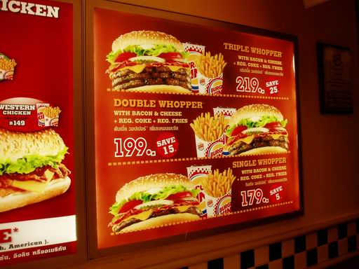
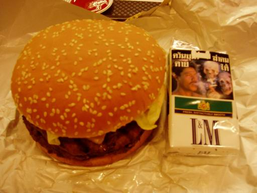
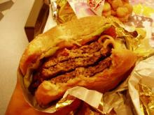
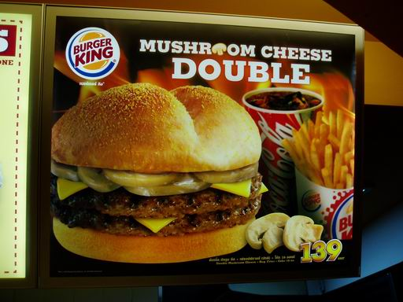

.. post:: 25 March, 2007
   :tags: Burger King
   :author: w.tknv
   :language: jp
   :location: Bangkok

バーガーキング(BURGER　KING)
====================================

| 日本では馴染みが薄いバーガーキング　
| 以前は、関東地方中心に出店してましたが日本から撤退してしまいました.
| また来年から出店するようです．
| もちろんアメリカのﾁｪｰﾝ店ですがバンコクでも10店ほど展開してます．

やはりここの看板メニューはワッパーの愛称の巨大バーガー

| 今日はトリプルワッパーを食しました．
| セサミ入りパン、レタス、玉ねぎ、チーズ，ﾍﾞｰｺﾝ それにビーフパティなんと3枚！！

お腹はちきれます

| ちまみにピクルス、トマトも入りますが苦手なのでカット
| うますぎます　これにハッシュポテトとコーラが付いたセットで220B（800円弱）
| 少々値段が張りますがその分の価値はあります.

| 最近2日に1回の割合でこれ食べてます. 
| ワッパーに比べて少々小ぶりですがマッシュルームとチーズが入り濃厚な味です.

