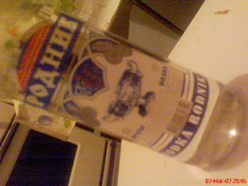
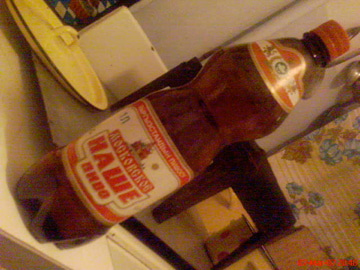
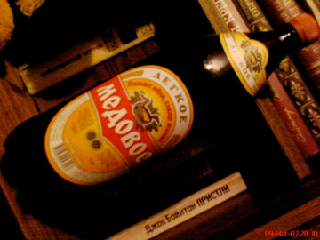
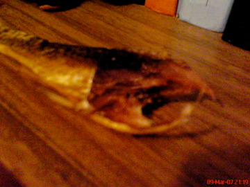
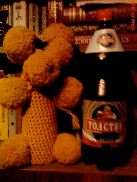
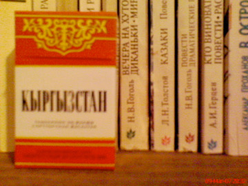

.. post:: 22 March, 2007
   :tags: vodka, beer
   :author: w.tknv
   :language: jp
   :location: kyrgyzstan

キルギスタンで散歩
=======================

| キルギスタンに散歩に行ってきました。
| もとソビエトなんで、まずはウオッカ、あんまりうまくないです。
| 地元の人は息を吐いてから、一気。理由はまずいからだと。
| たしかにこの飲み方をすると飲んでから息を吸うので酒の匂いが
| 鼻などから抜けないので、安酒で酔っぱらう知恵ですな。

| たぶん地元のビール、同じ柄で水色の方がうまいです。
| 値段相応の味、1リッターで35ソム(120円ぐらい)だったような

| こちらはロシアのビール、うまい！はちみつの匂いがしてすごくいい。
| 1.5リッターで75ソム、一本開けると仕上がります。仕上げたところで夜遊びする場所はありません。

これは、標高1500mにあるイシシクル湖(Issyk-kul、kulがキルギスタン語で湖なんですが)の魚の薫製、
ビールのつまにみ最高！

昼間は湖の透明度が高くて魚が警戒するのか漁師さんが密猟でそっちを警戒しているのか不明ですが、夜に捕って、
夜中に薫製して昼前にできあがったものを買う事ができます。

| これもロシアのビール、デブおやじという名前のビール、うまいですね.
| 横にあるお人形は、ウオッカの瓶に毛糸を巻いて作った、さすが、ロシア！、幼少の頃よりウオッカの英才教育を受けているのです。

お国のたばこです。

| 良い国です。食べ物はおいしいし、土壌が良いらしく野菜がとてもおいしい。
| 乳製品もパンもうまい。
| 野菜もシャーベットになっていないし、、、
| ソビエト時代に植えられた林檎がたくさんあるのですが、地元民はあまり食べず、馬の餌や外人用でした。
| あと、男性はスーパー縦社会です、年上が絶対です。