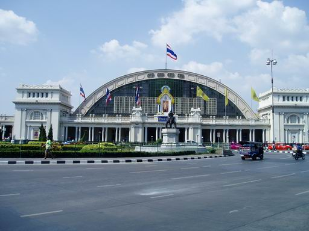
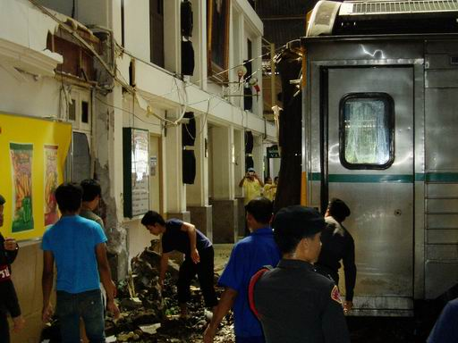
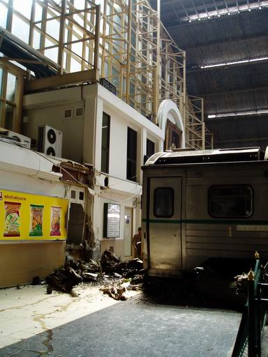

.. post:: 28 March, 2007
   :tags: 夏バテ
   :author: w.tknv
   :language: jp
   :location: Hua Lamphong Station

この暑さでやられたのか！！
====================================

今日午後２時半ごろ来月タイ南部に行くためにファランﾎﾟーン駅でチケットを買ってました．

これが外見何事もないようみ見える平和そうな駅

外国人専用レーンに並んでいたところいつものように旅行代理店のペテン師達が、ピンはねしようと
この列車は、出ないからなんて言ってた矢先

構内でドーンと鈍い音がしました

で、この有様　列車が車輪止めを乗り越え追突しました．１度壁にぶっかったのですがﾊﾟﾆｸｯて前進したようです．

先月もﾎｱﾋﾝ駅で衝突事故があり死者が出ました. 
幸いなことに今回は死者出てませんがこの暑さで思考回路の故障が原因か？？？

警官がﾏｲﾍﾟﾝﾗｲを連発していた

やはりタイ人、人間がでかい