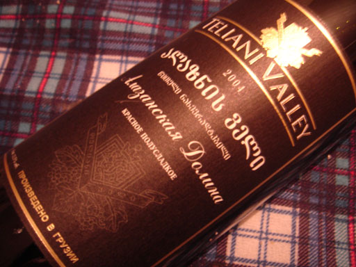
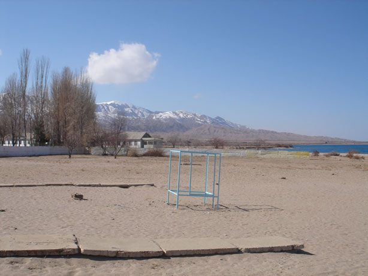

.. post:: 3 April, 2007
   :tags: wine, საქართველო
   :author: w.tknv
   :language: jp
   :location: Turkestan

中央アジアで、生活はいかがですかー
======================================

| 中央アジアで生活はいかがですかー、いいですよ。
| まず、普通にこんなデザインに会えます、このおまるに座したシュールな顔の少年を見れば分かると思うんですが、トイレットペーパーの挿絵です。
| いいですね。

スーパーにゆけば、こんな、**グルジアワインも普通に買えます。** 1000円から2000円出せばおいしいです。

ちょっと、バスなどにのれば、こんなに、きれいな湖も、天山も望めます。

| 食べ物はうまいし、温泉もあるし、老後の生活もいけますよ、
| ここで、ビジネスしませんか？
| リタイヤ後の人たちが住むところ、観光などのビジネスなどなど、
| ビザも特に問題ないし、OVIRも楽になりました、
| よかったらお気軽にご連絡ください。
| 町も山もガイドも致します。