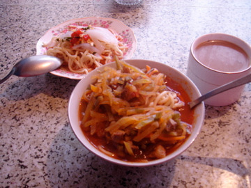

.. post:: 7 April, 2007
   :tags: laghman, ashlan-fu
   :author: w.tknv
   :language: jp
   :location: Turkestan

ラグマンとアシュラムフード
====================================

カザフスタンのナショナルフードとキルギスタンのナショナルフードたぶん、、、

| 奥がキルギスタンのナショナルフードのアシュラムフード.辛そうですがそんなに辛くないです.味は冷やし辛うどん.
| 夏に食べたいですね, 冬でもうまかった．
| 8ソム(30円弱)
| おすすめです、キルギスタンの軽食屋さんで食べれます、
| あっ、もしかしたら、アシュラムフードはドンガンの人の食べ物かも、、、
| 誰かご存知でしたら、教えて下さい。訂正します。
| 手前が、カザフスタンのナショナルフードのラグマン、うまいです。こちらは温かいです。
| もしかしたら、ラグマンもドンガンの人の食べ物かも、、、

| どちらにしても、カザフスタン、キルギスタンの食事は日本人(筆者)には合います。
| なんの問題もなく食べ物に関しては永住できる質です。
| たとえ、万が一、飽きてもロシア料理があります。