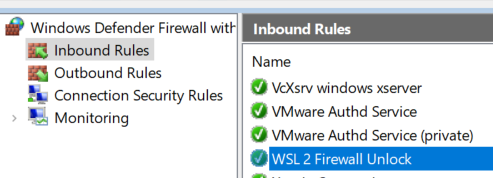

.. post:: 16 August, 2021
    :tags: Linux, Windows10, WSL2, SSHD, OpenSSH, PowerShell
    :category: WSL
    :author: w.tknv
    :language: jp

SSHで外部からWSLにログインできるようにするには
============================================================================

WSL2がインストールしてあること．

SSHDのセットアップ
---------------------------------------------

PowerShellから

.. code-block:: PowerShell

    ❯ wslconfig.exe /l
    Windows Subsystem for Linux Distributions:
    Ubuntu-18.04 (Default)

    ❯ wsl
    ❯ sudo apt install openssh-server

sshd_configの設定
^^^^^^^^^^^^^^^^^^^^^^^^^^^^^^^^^^^^^^^^^^

``/etc/ssh/sshd_config`` にパスワード認証を受け付ける，ログインできるユーザー<ore>を追加，ポートを22から55963に変更．

.. code-block::

    ...
    Port 55963
    ...
    PasswordAuthentication yes
    ...
    AllowUsers ore

SSHDの再起動
^^^^^^^^^^^^^^^^^^^^^^^^^^^^^^^^^^^

``sudo service ssh --full-restart``

ホストにきたSSHをWSLにフォワーディング
--------------------------------------------------------------

``WSL-SSHD-forward.ps1`` などとして下記のスクリプト作成 （ `参照 <https://github.com/microsoft/WSL/issues/4150#issuecomment-504209723>`_ ）

.. code-block:: PowerShell

    $remoteport = bash.exe -c "ifconfig eth0 | grep 'inet '"
    $found = $remoteport -match '\d{1,3}\.\d{1,3}\.\d{1,3}\.\d{1,3}';

    if( $found ){
    $remoteport = $matches[0];
    } else{
    echo "The Script Exited, the ip address of WSL 2 cannot be found";
    exit;
    }

    #[Ports]

    #All the ports you want to forward separated by coma
    $ports=@(55963);

    #[Static ip]
    #You can change the addr to your ip config to listen to a specific address
    $addr='0.0.0.0';
    $ports_a = $ports -join ",";

    #Remove Firewall Exception Rules
    iex "Remove-NetFireWallRule -DisplayName 'WSL 2 Firewall Unlock' ";

    #adding Exception Rules for inbound and outbound Rules
    iex "New-NetFireWallRule -DisplayName 'WSL 2 Firewall Unlock' -Direction Outbound -LocalPort $ports_a -Action Allow -Protocol TCP";
    iex "New-NetFireWallRule -DisplayName 'WSL 2 Firewall Unlock' -Direction Inbound -LocalPort $ports_a -Action Allow -Protocol TCP";

    for( $i = 0; $i -lt $ports.length; $i++ ){
        $port = $ports[$i];
        iex "netsh interface portproxy delete v4tov4 listenport=$port listenaddress=$addr";
        iex "netsh interface portproxy add v4tov4 listenport=$port listenaddress=$addr connectport=$port connectaddress=$remoteport";
    }

PowerShellにて ``./WSL-SSHD-forward.ps1`` で実行．

がOutbound Rulesでも確認できるはず．
本来はWSL2のSSHDを踏み台にしてシリアル接続をさせたかったがいろいろ試しハマったところ，どうやらできないようです．ArduinoのCIOもスレッドに登場している．

`WSL2: Ubuntu 18.04 Serial devices are no longer mounted properly · Issue #4322 · microsoft/WSL <https://github.com/microsoft/WSL/issues/4322>`_

VMware workstationのLinuxマシンをシリアルへの踏み台に
-----------------------------------------------------------------------------------------------

`i386 <https://www.debian.org/CD/netinst/>`_ をダウンロード，最小でインストールし，さっきのSSHDの設定をしてさらにユーザーがsudoできるように設定．VM ware workstation15にDebian11が選択にないがOther Linux 5.x or later kernelでいいはず．

.. code-block:: bash

    > su root
    > apt install sudo
    > visudo

ファイルの一番下にさっきのoreを追加

``ore   ALL=(ALL:ALL) ALL``

単なる踏み台なのでパスワードなしなら ``ore   ALL=(ALL:ALL) NOPASSWD:ALL``

シリアルUSBデバイスがこのVM　Linuxのどこにあるかは ``dmesg`` で刺した時を見たり， ``ls /dev``　でttyUSBXを確認して．

``sudo screen /dev/ttyUSBX 115200`` 115200はボーレート
