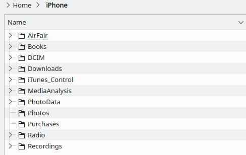

.. post:: 15 August, 2021
    :tags: iPhone, Linux, Photo
    :category: Linux
    :author: w.tknv
    :language: jp

Mount iPhone on Linux
======================

iPhoneで取った写真をLinuxに転送するには，

必要なライブラリのインストール
-----------------------------------------------------------------

Ubuntu 20.04.2 LTSで確認しています．

.. code-block:: bash

    sudo apt install ideviceinstaller libimobiledevice-utils libimobiledevice6 libplist3 ifuse usbmuxd libusbmuxd-tools

iPhoneをLinuxマシンに刺すとTrustするか？とでるのでTrustしないと進めません．

マウント
^^^^^^^^^^^^^^^^^^^^^

.. code-block:: bash

    sudo idevicepair pair
    sudo idevicepair validate
    ifuse <マウント先>

一回マウントしてUSB抜いたりして再度マウントしたい時
^^^^^^^^^^^^^^^^^^^^^^^^^^^^^^^^^^^^^^^^^^^^^^^^^^^^^^^^^^^^^^^^^^^^^^^^^^^^^^

うまくいかない時があります．その時は ``pkill ifuse`` で殺して，もう一度 ``ifuse <マウント先>`` 

マウント先はiPhone
